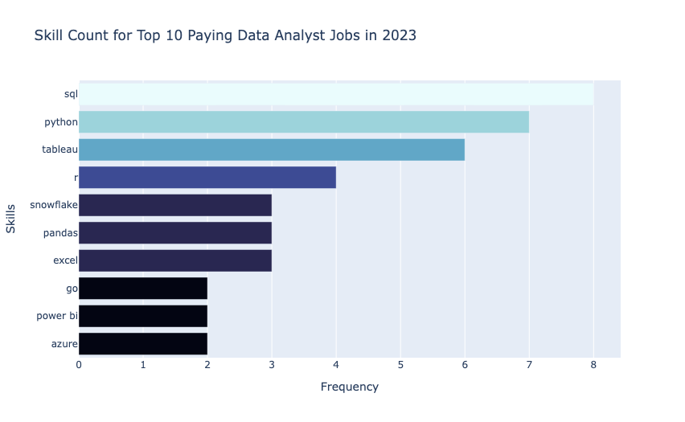

# Introduction
Dive into the data job market! Focusing on data analyst roles, this project explores & top-paying
top-paying jobs, in-demand skills, and where high demand meets high salary in data analytics.

🔎 SQL queries? Check them out here: [project sql_folder](/project_sql/)

# Background
Driven by a quest to navigate the data analyst job market more effectively, this project was born from a desire to pinpoint top-paid and in-demand skills, streamlining others work to find optimal jobs.

### The questions I wanted to answer through my SQL queries were:
1. What are the top-paying data analyst jobs?
2. What skills are required for these top-paying jobs?
3. What skills are most in demand for data analysts?
4. Which skills are associated with higher salaries?
5. What are the most optimal skills to learn?
# Tools I Used
For my deep dive into the data analyst job market, I harnessed the power of several key tools:
- **SQL**: The backbone of my analysis, allowing me to query the database and unearth critical insights.
- **PostgreSQL**: The chosen database management system, ideal for handling the job posting data.
- **Visual Studio Code**: My go-t for database management and executing SQL queries.
- **Git & GitHub**: Essential for version control and sharing my SQL scripts and analysis, ensuring collaboration and project tracking.
# The Analysis
Each query for this project aimed at investigating specific aspects of the data analyst job market.
Here's how I approached each question:
### 1. Top Paying Data Analyst Jobs
To identify the highest-paying roles I filtered data analyst positions by average yearly salary and location, focusing on remote jobs. This query highlights the high paying opportunities in the field.
```sql
SELECT  
    job_id, 
    job_title,
    job_location,
    job_schedule_type,
    salary_year_avg,
    job_posted_date,
    name AS company_name
FROM 
    job_postings_fact
    LEFT JOIN company_dim ON job_postings_fact.company_id = company_dim.company_id
WHERE
    job_location = 'Anywhere' AND 
    salary_year_avg IS NOT NULL AND
    job_title_short = 'Data Analyst'
ORDER BY 
    salary_year_avg DESC 
LIMIT 10;
```
Here's the breakdown of the top data analyst jobs in 2023:
- **Wide Salary Range:** Top 10 paying data analyst roles span from $184,000 to $650,000, indicating significant_salary potential in the field.
- **Diverse Employers:** Companies like SmartAsset, Meta, and AT&T are among those offering high salaries, showing a broad interest across different industries.
- **Job Title Variety:** There's a high diversity in job titles, from Data Analyst to Director of Analytics, reflecting varied roles and specializations within data analytics.

### 2. Skills for Top Paying Jobs
To understand what skills are required for the top-paying jobs, I joined the job postings with the skills data, providing insights into what employers value for high-compensation roles.
```sql
WITH top_paying_jobs AS (
    SELECT  
        job_id, 
        job_title,
        salary_year_avg,
        name AS company_name
    FROM 
        job_postings_fact
        LEFT JOIN company_dim ON job_postings_fact.company_id = company_dim.company_id
    WHERE
        job_location = 'Anywhere' AND 
        salary_year_avg IS NOT NULL AND
        job_title_short = 'Data Analyst'
    ORDER BY 
        salary_year_avg DESC 
    LIMIT 10
)
SELECT 
    top_paying_jobs.*,
    skills_dim.skills 
FROM top_paying_jobs
    INNER JOIN skills_job_dim ON skills_job_dim.job_id = top_paying_jobs.job_id
    INNER JOIN skills_dim ON skills_dim.skill_id = skills_job_dim.skill_id
ORDER BY salary_year_avg DESC;
```
Here's the breakdown of the most demanded skills for the top 10 highest paying data analyst jobs in 2023:
- **SQL** is leading with a bold count of 8.
- **Python** follows closely with a bold count of 7.
- **Tableau** is also highly sought after, with a bold count of 6.

*Bar graph visualizing the count of skills for the top 10 paying jobs for data analysts*

### 3. In-Demand Skills for Data Analysts
This query helped identify the skills most frequently requested in job postings, directing focus to areas with high demand.
```sql
SELECT 
    skills,
    COUNT(skills_job_dim.job_id) AS demand_count
FROM job_postings_fact
    INNER JOIN skills_job_dim ON job_postings_fact.job_id = skills_job_dim.job_id
    INNER JOIN skills_dim ON skills_job_dim.skill_id = skills_dim.skill_id
WHERE
    job_title_short = 'Data Analyst' AND
    job_work_from_home = TRUE
GROUP BY
    skills
ORDER BY
    demand_count DESC 
LIMIT 5;
```
Here's the breakdown of the most demanded skills for data analysts in 2023: 

- Employers value a combination of database management, spreadsheet analysis, programming, and data visualization skills, making SQL, Excel, and Python particularly important foundations for aspiring data analysts.

| Rank | Skill    | Demand Count |
|-----:|----------|-------------:|
| 1    | SQL      | 7,291        |
| 2    | Excel    | 4,611        |
| 3    | Python   | 4,330        |
| 4    | Tableau  | 3,745        |
| 5    | Power BI | 2,609        |

*Table of the demand for the top 5 skills in data analyst job postings*

### 4. Skills Based on Salary
Exploring the average salaries associated with different skills revealed which skills are the highest paying.
```sql
SELECT 
    skills,
    ROUND(AVG(salary_year_avg), 0) AS avg_salary
FROM job_postings_fact
    INNER JOIN skills_job_dim ON job_postings_fact.job_id = skills_job_dim.job_id
    INNER JOIN skills_dim ON skills_job_dim.skill_id = skills_dim.skill_id
WHERE 
    job_title_short = 'Data Analyst' AND
    salary_year_avg IS NOT NULL AND
    job_work_from_home = TRUE
GROUP BY 
    skills
ORDER BY 
    avg_salary DESC 
LIMIT 25;
```
Here's a breakdown of the results for top paying skills:
- **High Demand for Big Data & ML Skills**: Top salaries are commanded by analysts skilled in big data technologies (PySpark, Couchbase), machine learning tools (DataRobot, Jupyter), and Python libraries (Pandas, NumPy), reflecting the industry's high valuation of data processing and predictive modeling capabilities.
- **Software Development & Deployment Proficiency**: Knowledge in development and deployment tools (GitLab, Kubernetes, Airflow) indicates a lucrative crossover between data analysis and engineering, with a premium on skills that facilitate automation and efficient data pipeline management.
- **Cloud Computing Expertise**: Familiarity with cloud and data engineering tools (Elasticsearch, Databricks, GCP) underscores the growing importance of cloud-based analytics environments, suggesting that cloud proficiency significantly boosts earning potential in data analytics.

| Rank | Skill          | Average Salary |
|-----:|----------------|---------------:|
| 1    | PySpark        | $208,172       |
| 2    | Bitbucket      | $189,155       |
| 3    | Couchbase      | $160,515       |
| 4    | Watson         | $160,515       |
| 5    | DataRobot      | $155,486       |
| 6    | GitLab         | $154,500       |
| 7    | Swift          | $153,750       |
| 8    | Jupyter        | $152,777       |
| 9    | Pandas         | $151,821       |
| 10   | Elasticsearch  | $145,000       |

*Table of the average salary for the top 10 paying skills for data analysts*

### 5. Most Optimal Skills to Learn
Combining insights from demand and salary data, this query aimed to pinpoint skills that are both in high demand and have high salaries, offering a strategic focus for skill development.
```sql
SELECT 
    skills_dim.skill_id,
    skills_dim.skills,
    COUNT(skills_job_dim.job_id) AS demand_count,
    AVG(salary_year_avg) AS avg_salary
FROM job_postings_fact
    INNER JOIN skills_job_dim ON job_postings_fact.job_id = skills_job_dim.job_id
    INNER JOIN skills_dim ON skills_job_dim.skill_id = skills_dim.skill_id
WHERE
    job_title_short = 'Data Analyst' AND
    salary_year_avg IS NOT NULL AND
    job_work_from_home = TRUE
GROUP BY
    skills_dim.skill_id
HAVING
    COUNT(skills_job_dim.job_id) > 10
ORDER BY
    avg_salary DESC,
    demand_count DESC
LIMIT 25;
```
Here's a breakdown of the results for most optimal skills for data analysts in 2023:
- **Python ranks as one of the strongest overall choices**: it has a high demand of 236 postings (#2) while offering an average salary of $101,397. This makes Python a strong balance between demand and earning potential.
- **Tableau is another highly practical skill**: with 230 postings (#3) and an average salary of $99,288. Compared with more specialized skills such as Go or Hadoop, Tableau has much higher demand, making it particularly valuable for a data analyst career.
- **SQL-related and BI skills provide strong career value**: although SQL itself isn't shown in this dataset, tools such as SQL Server (35 postings), Oracle (37), and Looker (49) show demand for database and business-intelligence expertise. 

Overall, Python + SQL + Tableau/BI tools appears to be a strong combination for balancing job opportunities and salary.
| Rank | Skill       | Demand Count | Average Salary |
|-----:|-------------|-------------:|---------------:|
| 1    | Go          | 27           | $115,320       |
| 2    | Confluence  | 11           | $114,210       |
| 3    | Hadoop      | 22           | $113,193       |
| 4    | Snowflake   | 37           | $112,948       |
| 5    | Azure       | 34           | $111,225       |
| 6    | BigQuery    | 13           | $109,654       |
| 7    | AWS         | 32           | $108,317       |
| 8    | Java        | 17           | $106,906       |
| 9    | SSIS        | 12           | $106,683       |
| 10   | Jira        | 20           | $104,918       |

*Table of the most optimal skills for data analysts sorted by salary*
# What I Learned
Throughout this project, I honed several key SQL techniques and skills:
- **Complex Query Construction**: Learning to build advanced SQL queries that combine multiple tables and employ functions like **WITH** clauses for temporary tables.
- **Data Aggregation**: Utilizing **GROUP BY** and aggregate functions like **COUNT()** and **AVG()** to summarize data effectively.
- **Analytical Thinking**: Developing the ability to translate real-world questions into actionable SQL queries that got insightful answers.
# Conclusions
### Insights
From the analysis, several general insights emerged:

1. **Top-Paying Data Analyst Jobs**: The highest-paying jobs for data analysts that allow remote work offer a wide range of salaries, the highest at $650,000!
2. **Skills for Top-Paying Jobs**: High-paying data analyst jobs require advanced proficiency in SQL, suggesting it’s a critical skill for earning a top salary.
3. **Most In-Demand Skills**: SQL is also the most demanded skill in the data analyst job market, thus making it essential for job seekers.
4. **Skills with Higher Salaries**: Specialized skills, such as SVN and Solidity, are associated with the highest average salaries, indicating a premium on niche expertise.
5. **Optimal Skills for Job Market Value**: SQL leads in demand and offers for a high average salary, positioning it as one of the most optimal skills for data analysts to learn to maximize their market value.

### Closing Thoughts
This project enhanced my SQL skills and provided valuable insights into the data analyst job market. The findings from the analysis serve as a guide to prioritizing skill development and job search efforts. Aspiring data analysts can better position themselves in a competitive job market by focusing on high-demand, high-salary skills. This exploration highlights the importance of continuous learning and adaptation to emerging trends in the field of data analytics.